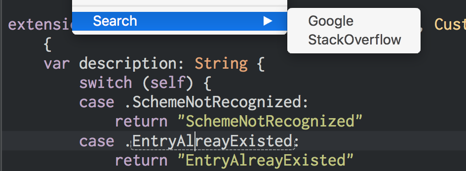

Xcode Search
============

A Xcode Source Editor Extension that searches external source(Google, StackOverflow, etc)

Usage
=====

1. Install Xcode 8 Beta
2. Run Xcode 8 Beta and install additional system components
3. Open terminal.app and execute `sudo /usr/libexec/xpccachectl` if you are using OS X 10.11
4. Reboot your mac
5. Open this project in Xcode 8 Beta and run the extension. Fix code signing issues if there are any. Extensions and the app need to be signed properly.
6. Choose an app to run: Xcode 8 Beta
7. Select your code
8. Choose menu `Editor > Search`

**Notice：**Currently the Source Editor Extension feature in Xcode 8 Beta is not very stable. You may find that the command is sometimes not showing up, or not available(grayed out).

TODO
====

* Multiline selection support
* More external sources for searching